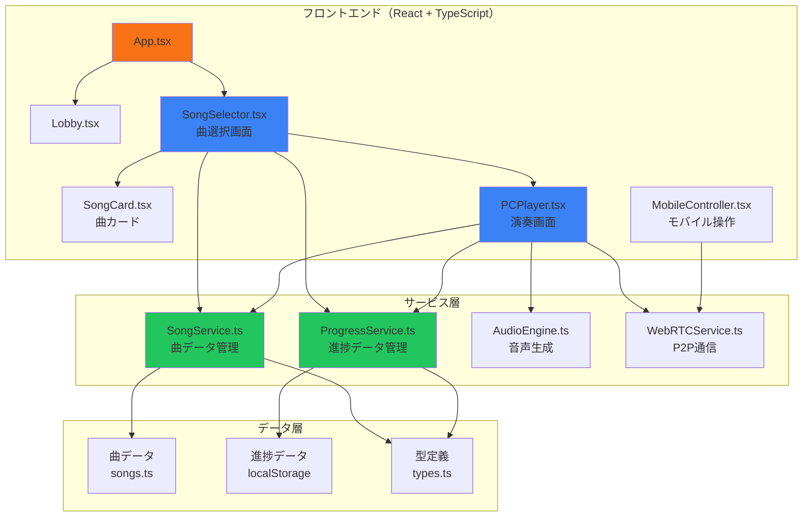
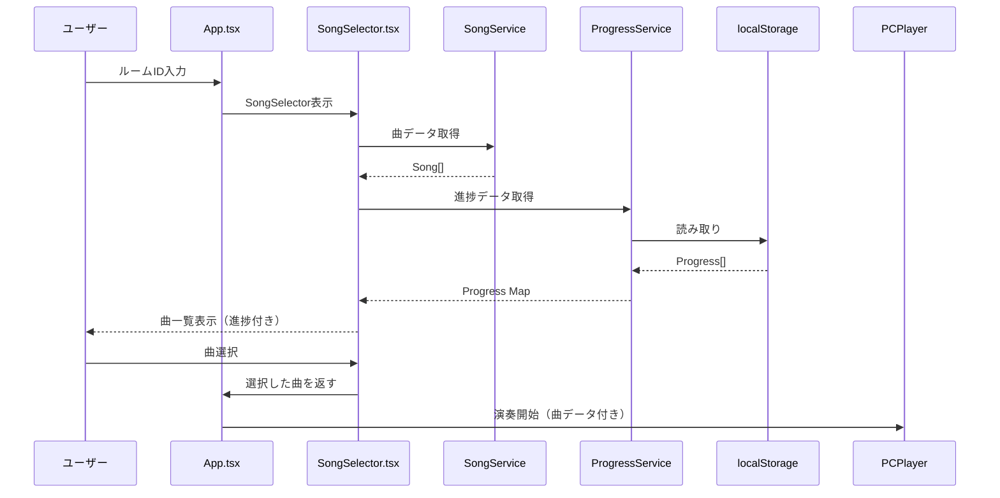
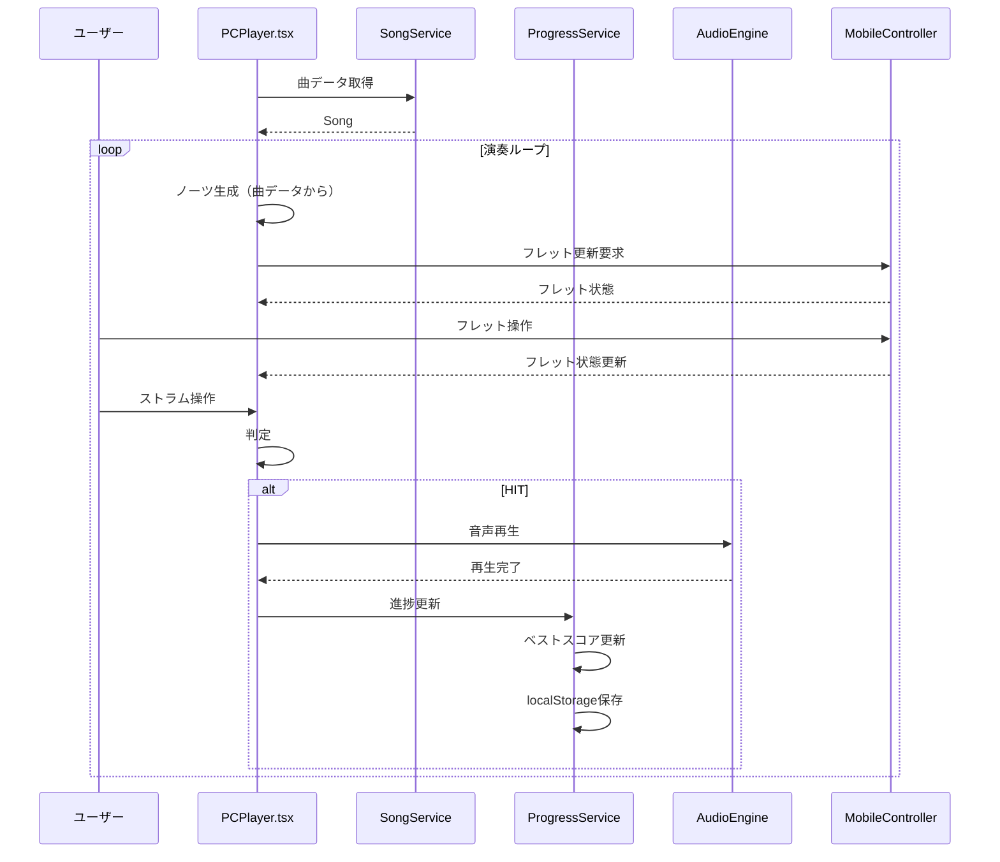

# 設計書: 曲学習機能（Song Learning Feature）

## 対応する要件

### 機能要件
- FR-1: 曲データの管理
- FR-2: 曲選択画面
- FR-3: コード譜表示
- FR-4: 学習進捗管理

### 非機能要件
- NFR-1: 初心者フレンドリーなUI/UX
- NFR-2: リアルタイム演奏フィードバック
- NFR-3: 段階的難易度システム
- NFR-4: 既存機能との互換性

### 制約条件
- TC-1: 技術スタック（React 19 + TypeScript + Vite）
- TC-2: 既存コードベースの制約（MobileControllerの4フレット制限）
- TC-3: データ格納場所（クライアント側）
- TC-4: UI言語（日本語優先）

---

## アーキテクチャ

### システム構成図



### アーキテクチャパターンの選択

#### 状態管理
- **採用案**: useState + localStorage
- **理由**:
  - 既存プロジェクトのパターンに従う
  - 状態の複雑度が低い（曲選択、進捗のみ）
  - 初期版はクライアント側のみで十分
  - 今後の拡張でContext APIへ移行可能

#### データ管理
- **採用案**: 独立したサービスクラス（SongService, ProgressService）
- **理由**:
  - データアクセスロジックを分離
  - 将来のサーバー移行時に容易に置換可能
  - テスト容易性の向上

#### コンポーネント構造
- **採用案**: 新規コンポーネント + 既存コンポーネントの拡張
- **理由**:
  - 既存機能への影響を最小化
  - 新機能は独立したコンポーネントとして実装
  - PCPlayer.tsxは曲データに対応した拡張のみ

---

## コンポーネント設計

### SongSelector.tsx（新規）

**責務**: 曲選択画面の表示・操作

**対応要件**: FR-2, NFR-1

**Props**:
```typescript
interface SongSelectorProps {
  onSelect: (song: Song) => void;  // 曲選択時のコールバック
}
```

**状態**:
```typescript
const [selectedDifficulty, setSelectedDifficulty] = useState<Difficulty | 'ALL'>('ALL');
const [songs, setSongs] = useState<Song[]>([]);
const [progress, setProgress] = useState<Map<string, Progress>>(new Map());
```

**主要メソッド**:
- `handleSongSelect(song: Song)`: 曲を選択して演奏開始
- `handleFilterChange(difficulty: Difficulty | 'ALL')`: 難易度フィルター変更
- `loadProgress()`: 進捗データをロード（ProgressService経由）

**UI構成**:
- 難易度フィルターボタン（全て/初級/中級/上級）
- 曲カード一覧（水平スクロールまたはグリッド）
- 各曲の進捗表示（スコア、クリア回数）

**スタイリング**:
- Tailwind CSS
- 難易度色分け（初級: 緑、中級: 黄色、上級: 赤）

---

### SongCard.tsx（新規）

**責務**: 各曲のカード表示

**対応要件**: FR-2, NFR-1

**Props**:
```typescript
interface SongCardProps {
  song: Song;
  progress?: Progress;
  onSelect: (song: Song) => void;
}
```

**UI構成**:
- 曲名・アーティスト名
- 難易度バッジ（色分け）
- BPM表示
- 進捗表示（ベストスコア、クリア回数）
- プレイボタン

**スタイリング**:
- Tailwind CSS
- ホバーエフェクト
- 難易度に応じた色

---

### PCPlayer.tsx（拡張）

**責務**: 演奏画面、コード譜表示

**対応要件**: FR-3, NFR-2, NFR-4

**変更点**:
- 新規Props: `currentSong: Song | null`
- `spawnNote()`の置き換え: 曲データに基づくノーツ生成
- ノーツ描画: コード名表示ロジックの強化

**拡張機能**:
```typescript
// 新規状態
const [currentSong, setCurrentSong] = useState<Song | null>(null);
const [noteIndex, setNoteIndex] = useState(0);

// 曲データに基づくノーツ生成
const spawnNoteFromSong = () => {
  if (!currentSong) return;
  const currentNote = currentSong.chordChart[noteIndex];
  if (!currentNote) return;

  notesRef.current.push({
    id: nextNoteId.current++,
    x: -100,
    chord: currentNote.chord,
    hit: false,
    missed: false
  });

  // 次のノートへ
  const nextNoteTime = currentNote.timestamp;
  // ... タイミング管理ロジック
};

// ノーツ描画の拡張（コード名表示）
const drawNote = (ctx: CanvasRenderingContext2D, note: Note) => {
  // 既存のノーツ描画ロジック
  // ...

  // コード名の表示
  if (note.chord) {
    ctx.fillText(note.chord, note.x, centerY + 18);
  } else {
    // 不明なコードの場合、フレット位置を表示
    ctx.fillText(`F${note.fret}`, note.x, centerY + 18);
  }
};
```

---

### App.tsx（変更）

**変更点**:
- `PCPlayer` に `currentSong` プロップを渡す
- `SongSelector` の追加と選択フローの実装

---

## データ設計

### 型定義（types.ts に追加）

```typescript
// 曲の難易度
export type Difficulty = 'EASY' | 'MEDIUM' | 'HARD';

// コード譜のエントリー
export interface ChordEntry {
  timestamp: number;  // ミリ秒（BPMに基づく）
  chord: string;      // コード名（C, G, D, Amなど）
}

// 曲データ
export interface Song {
  id: string;
  title: string;
  artist: string;
  difficulty: Difficulty;
  bpm: number;
  chordChart: ChordEntry[];
  totalChords: number;
}

// 進捗データ
export interface Progress {
  songId: string;
  bestScore: number;
  clearCount: number;
  lastPlayed: string;  // ISO日時文字列
}
```

### 曲データ構造（services/SongService.ts）

```typescript
export class SongService {
  private songs: Song[];

  constructor() {
    this.songs = this.loadSongs();
  }

  private loadSongs(): Song[] {
    return [
      {
        id: 'twinkle-twinkle-easy',
        title: 'きらきら星（初級）',
        artist: 'Traditional',
        difficulty: 'EASY',
        bpm: 60,
        chordChart: [
          { timestamp: 0, chord: 'C' },
          { timestamp: 2000, chord: 'G' },
          { timestamp: 4000, chord: 'C' },
          { timestamp: 6000, chord: 'F' },
          { timestamp: 8000, chord: 'C' },
          { timestamp: 10000, chord: 'G' },
          { timestamp: 12000, chord: 'C' },
        ],
        totalChords: 7
      },
      {
        id: 'wonder-wall-medium',
        title: 'Wonder Wall（中級）',
        artist: 'Oasis',
        difficulty: 'MEDIUM',
        bpm: 86,
        chordChart: [
          { timestamp: 0, chord: 'Em' },
          { timestamp: 1500, chord: 'G' },
          { timestamp: 3000, chord: 'D' },
          { timestamp: 4500, chord: 'A' },
          { timestamp: 6000, chord: 'C' },
          { timestamp: 7500, chord: 'D' },
          { timestamp: 9000, chord: 'A' },
          { timestamp: 10500, chord: 'C' },
        ],
        totalChords: 8
      },
      {
        id: 'stairway-hard',
        title: 'Stairway to Heaven（上級）',
        artist: 'Led Zeppelin',
        difficulty: 'HARD',
        bpm: 82,
        chordChart: [
          { timestamp: 0, chord: 'Am' },
          { timestamp: 1500, chord: 'G' },
          { timestamp: 3000, chord: 'C' },
          { timestamp: 4500, chord: 'D' },
          { timestamp: 6000, chord: 'F' },
          { timestamp: 7500, chord: 'G' },
          { timestamp: 9000, chord: 'Am' },
          { timestamp: 10500, chord: 'C' },
          { timestamp: 12000, chord: 'D' },
          { timestamp: 13500, chord: 'F' },
        ],
        totalChords: 10
      }
    ];
  }

  public getSongs(): Song[] {
    return this.songs;
  }

  public getSongById(id: string): Song | undefined {
    return this.songs.find(song => song.id === id);
  }

  public getSongsByDifficulty(difficulty: Difficulty): Song[] {
    return this.songs.filter(song => song.difficulty === difficulty);
  }
}
```

### 進捗データ構造（services/ProgressService.ts）

```typescript
export class ProgressService {
  private STORAGE_KEY = 'air_guitar_progress';

  public loadProgress(): Map<string, Progress> {
    const stored = localStorage.getItem(this.STORAGE_KEY);
    if (!stored) return new Map();

    const data: Progress[] = JSON.parse(stored);
    return new Map(data.map(p => [p.songId, p]));
  }

  public saveProgress(progress: Map<string, Progress>): void {
    const data = Array.from(progress.values());
    localStorage.setItem(this.STORAGE_KEY, JSON.stringify(data));
  }

  public updateProgress(songId: string, score: number, cleared: boolean): void {
    const progressMap = this.loadProgress();
    const existing = progressMap.get(songId);

    if (existing) {
      if (score > existing.bestScore) {
        existing.bestScore = score;
      }
      if (cleared) {
        existing.clearCount += 1;
      }
      existing.lastPlayed = new Date().toISOString();
    } else {
      progressMap.set(songId, {
        songId,
        bestScore: score,
        clearCount: cleared ? 1 : 0,
        lastPlayed: new Date().toISOString()
      });
    }

    this.saveProgress(progressMap);
  }

  public getProgress(songId: string): Progress | undefined {
    const progressMap = this.loadProgress();
    return progressMap.get(songId);
  }

  public getOverallProgress(): { cleared: number; total: number } {
    const progressMap = this.loadProgress();
    const cleared = Array.from(progressMap.values()).filter(p => p.clearCount > 0).length;
    return { cleared, total: new SongService().getSongs().length };
  }
}
```

---

## データフロー

### 曲選択フロー



### 演奏フロー



---

## ファイル構成

### 新規ファイル

```
frontend/
├── services/
│   ├── SongService.ts          # 曲データ管理サービス
│   └── ProgressService.ts      # 進捗データ管理サービス
├── components/
│   ├── SongSelector.tsx        # 曲選択画面
│   └── SongCard.tsx            # 曲カード表示
└── types.ts                    # 型定義（拡張）
```

### 変更ファイル

```
frontend/
├── App.tsx                     # SongSelectorの追加
└── components/
    └── PCPlayer.tsx            # 曲データ対応、コード譜表示
```

---

## 実装優先順序

### Phase 1: データ層（優先度高）
1. 型定義の追加（types.ts）
2. SongServiceの実装
3. ProgressServiceの実装
4. サンプル曲データの作成

### Phase 2: UIコンポーネント（中優先度）
1. SongCardの実装
2. SongSelectorの実装
3. App.tsxの変更（SongSelectorの統合）

### Phase 3: 演奏機能拡張（高優先度）
1. PCPlayer.tsxの拡張（曲データ対応）
2. ノーツ生成ロジックの置き換え
3. コード譜表示の実装
4. 進捗更新の実装

### Phase 4: テスト・調整（中優先度）
1. 難易度フィルタリングのテスト
2. 進捗保存・読み込みのテスト
3. 既存機能との互換性確認
4. パフォーマンス最適化

---

## UI/UX設計

### 難易度フィルター

```typescript
// SongSelector.tsx
const DifficultyFilter: React.FC<{
  selected: Difficulty | 'ALL';
  onSelect: (d: Difficulty | 'ALL') => void;
}> = ({ selected, onSelect }) => {
  const filters: Array<{ value: Difficulty | 'ALL'; label: string; color: string }> = [
    { value: 'ALL', label: '全て', color: 'bg-slate-700' },
    { value: 'EASY', label: '初級', color: 'bg-green-500' },
    { value: 'MEDIUM', label: '中級', color: 'bg-yellow-500' },
    { value: 'HARD', label: '上級', color: 'bg-red-500' },
  ];

  return (
    <div className="flex gap-2">
      {filters.map(filter => (
        <button
          key={filter.value}
          onClick={() => onSelect(filter.value)}
          className={`px-4 py-2 rounded-full font-black text-sm transition-all ${
            selected === filter.value
              ? `${filter.color} text-white scale-110 shadow-lg`
              : 'bg-slate-800 text-slate-400 hover:bg-slate-700'
          }`}
        >
          {filter.label}
        </button>
      ))}
    </div>
  );
};
```

### 曲カードデザイン

```typescript
// SongCard.tsx
const SongCard: React.FC<SongCardProps> = ({ song, progress, onSelect }) => {
  const difficultyColors = {
    EASY: 'border-green-500 bg-green-500/10',
    MEDIUM: 'border-yellow-500 bg-yellow-500/10',
    HARD: 'border-red-500 bg-red-500/10'
  };

  const difficultyLabels = {
    EASY: '初級',
    MEDIUM: '中級',
    HARD: '上級'
  };

  return (
    <div
      onClick={() => onSelect(song)}
      className={`p-6 rounded-2xl border-2 cursor-pointer transition-all hover:scale-105 active:scale-95 ${difficultyColors[song.difficulty]}`}
    >
      <div className="flex justify-between items-start mb-4">
        <div>
          <h3 className="text-xl font-black text-white mb-1">{song.title}</h3>
          <p className="text-slate-400 text-sm">{song.artist}</p>
        </div>
        <div className={`px-3 py-1 rounded-full text-xs font-black ${
          song.difficulty === 'EASY' ? 'bg-green-500' :
          song.difficulty === 'MEDIUM' ? 'bg-yellow-500' :
          'bg-red-500'
        } text-white`}>
          {difficultyLabels[song.difficulty]}
        </div>
      </div>

      <div className="flex justify-between items-center text-sm">
        <div className="flex gap-4">
          <div>
            <span className="text-slate-500">BPM</span>
            <span className="text-white font-bold ml-1">{song.bpm}</span>
          </div>
          <div>
            <span className="text-slate-500">コード</span>
            <span className="text-white font-bold ml-1">{song.totalChords}</span>
          </div>
        </div>

        {progress && (
          <div className="text-right">
            <div className="text-orange-400 font-bold">
              ベスト: {progress.bestScore.toLocaleString()}
            </div>
            <div className="text-slate-400 text-xs">
              クリア: {progress.clearCount}回
            </div>
          </div>
        )}
      </div>
    </div>
  );
};
```

---

## 既存機能との互換性

### 互換性維持のための設計

1. **PCPlayer.tsxの変更最小化**:
   - 既存のノーツ生成ロジックは拡張のみ、置き換えではあるがロジックは明確に分離
   - 既存のコンボシステム、スコアシステムはそのまま使用
   - 既存の`getCurrentChord`ロジックは活用

2. **MobileController.tsxの変更なし**:
   - 既存の4フレット制限を維持
   - 既存のコードショートカット（C, G, D, Am）を活用

3. **WebRTC通信の変更なし**:
   - 既存のメッセージ形式（FRET_UPDATE）を維持
   - 既存のシグナリングフローを維持

---

## 今後の拡張計画

### Phase 5: サーバー側移行
- 曲データベースのサーバー側管理
- APIエンドポイントの追加
- ユーザーアカウントシステム

### Phase 6: 高度機能
- オンラインランキング
- カスタム曲のアップロード
- 曲の共有機能
- 練習モード（速度調整、ループ再生）

---

## 受け入れ基準チェックリスト

### 機能要件
- [ ] FR-1: 曲データを定義でき、サンプルデータ（初級1、中級1、上級1）を含むこと
- [ ] FR-2: 曲選択画面が表示され、難易度フィルタリングが機能すること
- [ ] FR-3: ノーツ上にコード名が表示されること
- [ ] FR-4: ベストスコアとクリア回数が記録されること

### 非機能要件
- [ ] NFR-1: 初心者用曲が1つの曲で使用するコードが3つ以下であること
- [ ] NFR-2: WebRTC通信の遅延が100ms以内であること
- [ ] NFR-3: 難易度が段階的に上がること（初級: 60-80 BPM、中級: 80-100 BPM、上級: 100+ BPM）
- [ ] NFR-4: 既存のPC MODE、MOBILE MODEが正常に動作すること
