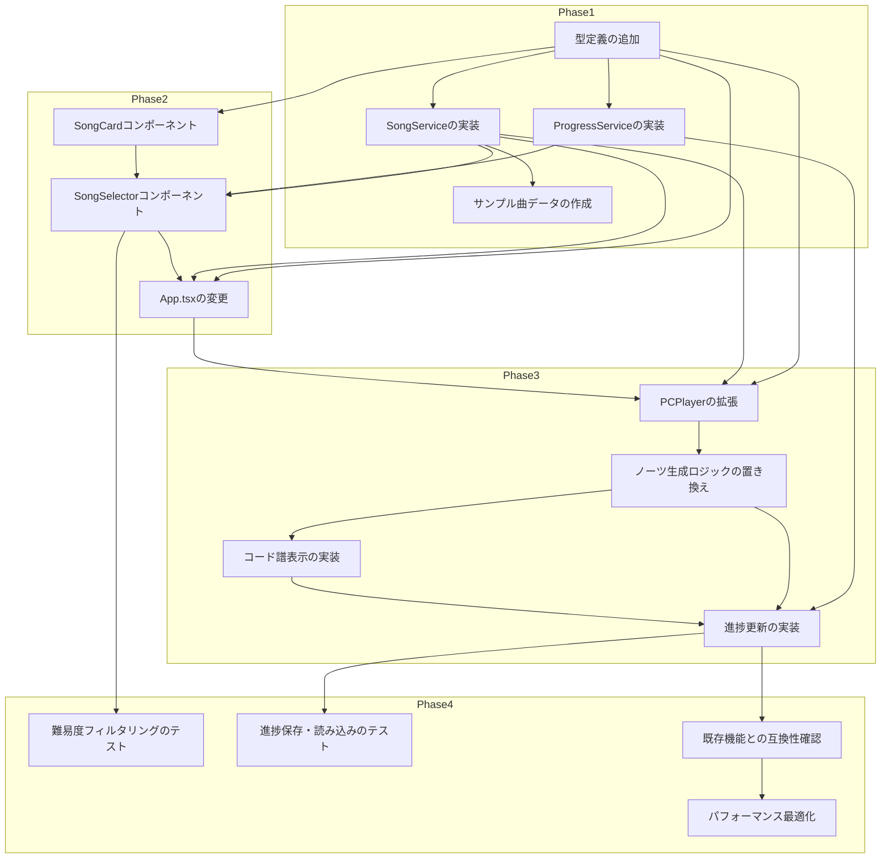

# 実装タスク: 曲学習機能（Song Learning Feature）

## 概要
- 総フェーズ数: 4
- 総タスク数: 16件
- 見積合計: S:12, M:4

---

## Phase 1: データ層

### 目的
曲データと進捗データの基盤を構築し、他のすべての機能の依存関係となる型定義とサービスを作成する。

- [ ] 1-1: 型定義の追加
  - **What**: types.tsに曲学習機能用の型定義を追加（Difficulty, ChordEntry, Song, Progress）
  - **Where**: frontend/types.ts
  - **How**: 設計書のデータ設計セクションにある型定義をそのまま追加
    - Difficulty型: 'EASY' | 'MEDIUM' | 'HARD'
    - ChordEntryインターフェース: timestamp, chord
    - Songインターフェース: id, title, artist, difficulty, bpm, chordChart, totalChords
    - Progressインターフェース: songId, bestScore, clearCount, lastPlayed
  - **Why**: FR-1（曲データの管理）、FR-4（学習進捗管理）の基盤となる型定義
  - **Verify**: TypeScriptコンパイルでエラーがないこと、型が正しく定義されていること
  - **見積**: S
  - **依存**: なし

- [ ] 1-2: SongServiceの実装
  - **What**: 曲データを管理するサービスクラスを作成（曲データの取得、フィルタリング）
  - **Where**: frontend/services/SongService.ts（新規）
  - **How**:
    - SongServiceクラスを作成（コンストラクタで曲データを初期化）
    - loadSongs()メソッドでサンプル曲データを定義（初級1曲、中級1曲、上級1曲）
    - getSongs()メソッドで全曲を返す
    - getSongById(id)メソッドで特定の曲を返す
    - getSongsByDifficulty(difficulty)メソッドで難易度フィルタリング
  - **Why**: FR-1（曲データの管理）、曲データの一元管理と拡張性確保
  - **Verify**:
    - 全曲を取得できること（3曲）
    - 難易度でフィルタリングできること
    - IDで特定の曲を取得できること
  - **見積**: M
  - **依存**: 1-1

- [ ] 1-3: ProgressServiceの実装
  - **What**: 進捗データを管理するサービスクラスを作成（localStorageとの連携）
  - **Where**: frontend/services/ProgressService.ts（新規）
  - **How**:
    - ProgressServiceクラスを作成
    - loadProgress()メソッドでlocalStorageから進捗データを読み込み
    - saveProgress()メソッドで進捗データをlocalStorageに保存
    - updateProgress(songId, score, cleared)メソッドで進捗を更新
    - getProgress(songId)メソッドで特定の曲の進捗を取得
    - getOverallProgress()メソッドで全体の進捗（クリアした曲数/全曲数）を取得
  - **Why**: FR-4（学習進捗管理）、進捗データの永続化と管理
  - **Verify**:
    - 進捗データをlocalStorageに保存できること
    - 進捗データをlocalStorageから読み込めること
    - ベストスコアが更新されること
    - クリア回数が増加すること
  - **見積**: M
  - **依存**: 1-1

- [ ] 1-4: サンプル曲データの作成
  - **What**: SongServiceにサンプル曲データを追加（初級1曲、中級1曲、上級1曲）
  - **Where**: frontend/services/SongService.ts（1-2の一部）
  - **How**:
    - 初級曲: きらきら星（BPM 60、コード3種類：C, G, F）
    - 中級曲: Wonder Wall（BPM 86、コード4-6種類：Em, G, D, A, C）
    - 上級曲: Stairway to Heaven（BPM 82、コード7種類以上：Am, G, C, D, F）
    - 各曲のchordChartにタイミングとコード名を設定
  - **Why**: FR-1（サンプルデータとして最低3曲）、NFR-3（段階的難易度システム）
  - **Verify**:
    - 初級曲がコード3種類以下であること
    - 中級曲がコード4-6種類であること
    - 上級曲がコード7種類以上であること
    - BPMが難易度に応じた範囲であること（初級: 60-80、中級: 80-100、上級: 100+）
  - **見積**: S
  - **依存**: 1-2

---

## Phase 2: UIコンポーネント

### 目的
曲選択画面と曲カード表示コンポーネントを作成し、ユーザーが曲を選択できるUIを実装する。

- [ ] 2-1: SongCardコンポーネントの実装
  - **What**: 各曲のカードを表示するコンポーネントを作成
  - **Where**: frontend/components/SongCard.tsx（新規）
  - **How**:
    - SongCardPropsインターフェースを定義（song, progress, onSelect）
    - 曲名、アーティスト名、難易度バッジ、BPM、進捗を表示
    - 難易度に応じた色分け（初級: 緑、中級: 黄色、上級: 赤）
    - ホバーエフェクトとクリック時の縮小アニメーション
    - Tailwind CSSでスタイリング
  - **Why**: FR-2（曲選択画面）、NFR-1（初心者フレンドリーなUI/UX）
  - **Verify**:
    - 曲情報が正しく表示されること
    - 難易度に応じた色分けが機能すること
    - 進捗（ベストスコア、クリア回数）が表示されること
    - クリックでonSelectが呼び出されること
  - **見積**: M
  - **依存**: 1-1

- [ ] 2-2: SongSelectorコンポーネントの実装
  - **What**: 曲選択画面全体を作成（フィルターと曲一覧）
  - **Where**: frontend/components/SongSelector.tsx（新規）
  - **How**:
    - SongSelectorPropsインターフェースを定義（onSelect）
    - 難易度フィルターの状態管理（useState: selectedDifficulty）
    - 曲リストの状態管理（useState: songs）
    - 進捗の状態管理（useState: progress）
    - useEffectでSongServiceから曲データをロード
    - useEffectでProgressServiceから進捗データをロード
    - handleFilterChangeメソッドで難易度フィルター変更
    - handleSongSelectメソッドで曲選択
    - DifficultyFilterサブコンポーネントでフィルターボタンを表示
    - SongCardコンポーネントで曲一覧を表示（水平スクロールまたはグリッド）
    - Tailwind CSSでスタイリング
  - **Why**: FR-2（曲選択画面、難易度フィルタリング）、NFR-1（初心者フレンドリーなUI/UX）
  - **Verify**:
    - 曲リストが表示されること
    - 難易度フィルタリングが機能すること
    - 進捗データが表示されること
    - 曲選択でonSelectが呼び出されること
  - **見積**: M
  - **依存**: 1-1, 1-2, 1-3, 2-1

- [ ] 2-3: App.tsxの変更（SongSelectorの統合）
  - **What**: App.tsxにSongSelectorを追加し、曲選択フローを実装
  - **Where**: frontend/App.tsx
  - **How**:
    - 新規状態: selectedSong（Song | null）
    - handleRoleSelectの拡張: PC_PLAYER選択時にSongSelectorを表示
    - handleSongSelectメソッドの追加: 曲選択時にPCPlayerへ遷移
    - PCPlayerにcurrentSongプロップを渡す
    - 既存のLobby → PC PLAYERフローを維持
    - 新しいLobby → SongSelector → PC PLAYERフローを追加
  - **Why**: FR-2（曲選択画面）、NFR-4（既存機能との互換性）
  - **Verify**:
    - PC PLAYER選択時にSongSelectorが表示されること
    - 曲選択後にPCPlayerが表示されること
    - PCPlayerに曲データが渡されていること
    - 既存のMOBILE MODEが正常に動作すること
  - **見積**: M
  - **依存**: 1-1, 1-2, 2-2

---

## Phase 3: 演奏機能拡張

### 目的
PCPlayerを拡張して曲データに基づく演奏を実装し、コード譜表示と進捗更新を機能させる。

- [ ] 3-1: PCPlayerの拡張（曲データ対応）
  - **What**: PCPlayerにcurrentSong状態と曲データ読み込みを追加
  - **Where**: frontend/components/PCPlayer.tsx
  - **How**:
    - 新規Props: currentSong: Song | null
    - 新規状態: noteIndex（曲のノートインデックス）
    - useEffectでcurrentSongが変更された時にnoteIndexをリセット
    - SongServiceから曲データを取得（必要な場合）
  - **Why**: FR-3（コード譜表示）、曲データに基づく演奏の基盤
  - **Verify**:
    - currentSongプロップを受け取れること
    - noteIndexが管理されていること
    - 曲データが正しく設定されていること
  - **見積**: S
  - **依存**: 1-1, 1-2, 2-3

- [ ] 3-2: ノーツ生成ロジックの置き換え
  - **What**: 既存のランダムノーツ生成を曲データに基づくノーツ生成に置き換え
  - **Where**: frontend/components/PCPlayer.tsx（gameLoop内のspawnNoteロジック）
  - **How**:
    - 既存のspawnNote()関数をspawnNoteFromSong()に置き換え
    - 曲データのchordChart[noteIndex]からコード名を取得
    - BPMに基づいてノーツ生成タイミングを計算
    - ノーツオブジェクトにchordプロパティを追加
    - noteIndexをインクリメント
    - 曲の最後まで到達したら演奏終了処理
  - **Why**: FR-3（曲に沿ったコード譜表示）、NFR-2（リアルタイム演奏フィードバック）
  - **Verify**:
    - ノーツが曲データに基づいて生成されること
    - BPMに基づいたタイミングでノーツが生成されること
    - ノーツにコード名が含まれていること
  - **見積**: M
  - **依存**: 3-1

- [ ] 3-3: コード譜表示の実装
  - **What**: ノーツ描画時にコード名を表示するロジックを追加
  - **Where**: frontend/components/PCPlayer.tsx（gameLoop内のノーツ描画ロジック）
  - **How**:
    - 既存のノーツ描画ロジック（drawNote関数内）を拡張
    - note.chordが存在する場合、コード名を表示
    - note.chordが存在しない場合（不明なコード）、既存のF${note.fret}を表示
    - コード名のフォントサイズ、色を調整（読みやすく）
    - コードチェンジのタイミングを視覚的に認識できるようにする
  - **Why**: FR-3（ノーツ上にコード名を表示）、不明なコードはフレット位置を表示
  - **Verify**:
    - ノーツ上にコード名が表示されること
    - 不明なコードの場合、フレット位置が表示されること
    - コード名が読みやすいこと
  - **見積**: S
  - **依存**: 3-2

- [ ] 3-4: 進捗更新の実装
  - **What**: 演奏終了時に進捗データを更新
  - **Where**: frontend/components/PCPlayer.tsx
  - **How**:
    - 演奏終了時（曲の最後まで到達した時）の処理を追加
    - 現在のスコアとクリア状態（全ノートのX%以上をHIT）を判定
    - ProgressService.updateProgress()を呼び出して進捗を更新
    - ベストスコアの更新
    - クリア回数の増加
    - 初心者が最初の曲をクリアした時の達成メッセージを表示
  - **Why**: FR-4（ベストスコア、クリア回数の記録）、達成メッセージの表示
  - **Verify**:
    - ベストスコアが記録されること
    - クリア回数が増加すること
    - 最初の曲クリア時に達成メッセージが表示されること
    - localStorageに進捗データが保存されること
  - **見積**: M
  - **依存**: 1-3, 3-2, 3-3

---

## Phase 4: テスト・調整

### 目的
実装した機能をテストし、既存機能との互換性を確認し、パフォーマンスを最適化する。

- [ ] 4-1: 難易度フィルタリングのテスト
  - **What**: SongSelectorの難易度フィルタリング機能をテスト
  - **Where**: 手動テスト（ブラウザ）
  - **How**:
    - 「全て」を選択して全曲が表示されることを確認
    - 「初級」を選択して初級曲のみが表示されることを確認
    - 「中級」を選択して中級曲のみが表示されることを確認
    - 「上級」を選択して上級曲のみが表示されることを確認
    - 色分けが正しく機能していることを確認（初級: 緑、中級: 黄色、上級: 赤）
  - **Why**: FR-2（難易度フィルタリング）、NFR-1（初心者フレンドリーなUI/UX）
  - **Verify**:
    - 各フィルターが正しく機能すること
    - 色分けが正しいこと
  - **見積**: S
  - **依存**: 2-2

- [ ] 4-2: 進捗保存・読み込みのテスト
  - **What**: ProgressServiceのlocalStorage連携をテスト
  - **Where**: 手動テスト（ブラウザ）
  - **How**:
    - 曲を演奏してスコアを記録する
    - ページをリロードして進捗データが維持されていることを確認
    - ベストスコアが更新されることを確認
    - クリア回数が増加することを確認
    - localStorageからデータを削除してリセットが機能することを確認
  - **Why**: FR-4（ベストスコア、クリア回数の記録）
  - **Verify**:
    - 進捗データがlocalStorageに保存されること
    - リロード後に進捗データが読み込まれること
    - ベストスコアが更新されること
    - クリア回数が増加すること
  - **見積**: S
  - **依存**: 3-4

- [ ] 4-3: 既存機能との互換性確認
  - **What**: 既存の演奏機能に影響がないことを確認
  - **Where**: 手動テスト（ブラウザ）
  - **How**:
    - 既存のPC MODE（曲選択しないモード）が正常に動作することを確認
    - 既存のMOBILE MODEが正常に動作することを確認
    - WebRTC通信が正常に機能することを確認
    - 既存のコンボシステムが機能することを確認
    - 既存のスコアシステムが機能することを確認
    - MobileControllerの4フレット制限が維持されていることを確認
    - 既存のコードショートカット（C, G, D, Am）が機能することを確認
  - **Why**: NFR-4（既存機能との互換性）
  - **Verify**:
    - 既存のPC MODEが正常に動作すること
    - 既存のMOBILE MODEが正常に動作すること
    - WebRTC通信が機能すること
    - コンボ、スコアシステムが機能すること
  - **見積**: M
  - **依存**: 3-4

- [ ] 4-4: パフォーマンス最適化
  - **What**: アプリケーションのパフォーマンスを最適化
  - **Where**: 全ファイル
  - **How**:
    - React.memoを必要なコンポーネントに適用（SongCardなど）
    - useCallback、useMemoを適切に使用
    - 不必要な再レンダリングを削減
    - localStorageのアクセスを最小化（useEffectで一度だけロード）
    - TypeScriptコンパイルでエラーがないことを確認
    - ブラウザのコンソールで警告がないことを確認
  - **Why**: NFR-2（リアルタイム演奏フィードバック）、スムーズなユーザー体験
  - **Verify**:
    - アプリケーションがスムーズに動作すること
    - 不必要な再レンダリングが発生しないこと
    - コンソールにエラーや警告がないこと
  - **見積**: S
  - **依存**: 4-3

---

## 依存関係図

---

## 実行順序

1. **Phase 1（データ層）**: 1-1 → 1-2 → 1-3 → 1-4
2. **Phase 2（UIコンポーネント）**: 2-1 → 2-2 → 2-3
3. **Phase 3（演奏機能拡張）**: 3-1 → 3-2 → 3-3 → 3-4
4. **Phase 4（テスト・調整）**: 4-1 → 4-2 → 4-3 → 4-4

---

## 総見積

- S: 12タスク（約12-24時間）
- M: 4タスク（約8-16時間）
- 合計: 約20-40時間
